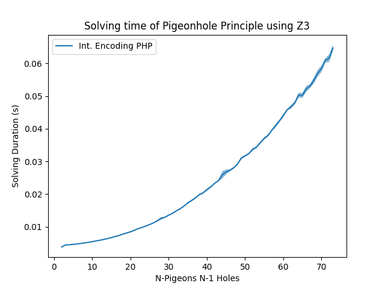

# Z3 Experiments

Experiments on SAT / UNSAT problems using Z3.

1. Pigeonhole Principle (PHP) Experiments of UNSAT expensive to evaluate problems. [PHP](php.py)
2. Sudoku Solver [Sudoku](sudoku.py)

## Requirements

`pip install -r requirements.txt`

## Run

1. `python php.py`

2. `python sudoku.py`

Time-Performance of Z3 on Integer Encoded PHP.

